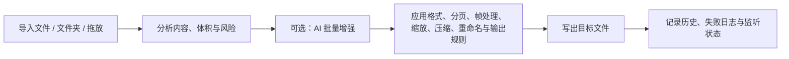

<p align="center">
  
</p>

<h1 align="center">Imvix Pro</h1>

<p align="center">
  面向批处理、AI 辅助、文档/图像混合输入与 Windows 工作流集成的专业桌面转换工具
</p>

<p align="center">
  简体中文 | <a href="README.en.md">English</a>
</p>

<p align="center">
  <a href="https://get.microsoft.com/installer/download/9n3ztwz2f3z9?referrer=appbadge" target="_self">
    
  </a>
</p>

<p align="center">
  .NET 10 | Avalonia 11 | MVVM | Local AI Runtime | PDF / PSD / GIF / OCR / QR / Barcode
</p>

> Imvix Pro 不再只是“改后缀”的普通图片转换器。当前 Pro 版更接近一套围绕图片、文档、图标资源和自动化工作流构建的桌面处理工作台：支持批量转换、PDF 与 GIF 展开导出、PSD 预览、离线 AI 增强、预览智能工具、文件夹监听，以及 Windows 集成能力。

## 项目概览

Imvix Pro 是一个以 Windows 为主要落地平台的桌面转换工具，当前仓库版本为 `2.0.0`。  
它将格式转换、批量压缩、尺寸调整、智能分析、PDF/PSD 处理、离线 AI 工具、最近历史、失败日志和文件夹监听整合进同一套桌面工作流中。

相较于早期普通版 README 所描述的“单纯图片转换器”，当前 Pro 版已经明显扩展为：

- 支持图像、矢量、PDF、PSD、EXE 图标、桌面快捷方式图标的混合输入
- 支持 `PDF` 作为正式输出格式，且具备分页、范围和拆分策略
- 支持本地离线 AI 批量增强，以及预览窗口中的 AI 增强、AI 抠图、AI 橡皮擦
- 支持 OCR、二维码识别、条码识别、文件详情分析与 Windows 集成能力
- 支持将“当前设置”保存为预设，或另存为文件夹监听配置，形成可重复执行的工作流

## 核心能力

| 方向 | 当前 Pro 版能力 |
| --- | --- |
| 混合导入 | 支持多文件导入、文件夹导入、拖放导入，可处理 PNG、JPG、JPEG、WEBP、BMP、GIF、TIFF、TIF、ICO、SVG、PDF、PSD、EXE、LNK |
| 转换导出 | 支持输出 PNG、JPEG、WEBP、BMP、GIF、TIFF、ICO、SVG、PDF，并支持源目录或自定义目录输出 |
| 批量规则 | 支持压缩质量、尺寸策略、重命名规则、覆盖控制、透明背景处理、ICO/SVG 背景设置 |
| PDF / GIF 专项 | 支持 PDF 当前页、全部页、页码范围、拆分单页 PDF；支持 GIF 首帧、指定帧、全部帧导出 |
| AI 批量增强 | 支持本地离线 AI 批量图像增强，增强完成后继续进入既有转换管线 |
| 预览智能工具 | 预览窗口支持 AI 增强对比、AI 抠图、AI 橡皮擦、OCR 文本识别、二维码扫描、条码扫描 |
| 工作流能力 | 支持预设、暂停/继续/取消、最近历史、失败日志、输出完成后打开目录、文件夹监听模式 |
| Windows 集成 | 支持系统托盘、开机启动、桌面快捷方式、Windows 右键“Open with Imvix Pro” |
| 本地化与体验 | 支持 10 种界面语言、亮色/暗色/跟随系统主题、窗口位置记忆、PDF 锁定提示与解锁流程 |

## 支持范围

| 类型 | 范围 |
| --- | --- |
| 批量导入 / 打开 | PNG、JPG、JPEG、WEBP、BMP、GIF、TIFF、TIF、ICO、SVG、PDF、PSD、EXE、LNK |
| 批量输出 | PNG、JPEG、WEBP、BMP、GIF、TIFF、ICO、SVG、PDF |
| AI 批量增强输入 | PNG、JPG、JPEG、WEBP、BMP、静态 TIFF、单帧 GIF |
| 预览 AI 抠图 / 橡皮擦 | 受支持的静态光栅图像 |
| 预览 OCR / QR / 条码 | 受支持的可预览图像内容，以及 PDF/PSD 等渲染预览结果 |

补充说明：

- 当批量任务中包含 `PDF`、`PSD`、`SVG`、动态 `GIF` 或其他不适合 AI 批量增强的输入时，这些文件会跳过 AI 增强，继续走标准转换链路。
- `PDF` 输入既可以导出为图片，也可以继续导出为 `PDF`，并支持全部页、当前页、页码范围和拆分单页策略。
- `GIF` 输入支持首帧、指定帧、全部帧策略；当输出不是 `GIF` 时，可按帧展开导出。
- `EXE` 和 `LNK` 主要用于提取与转换图标资源。

## AI 与智能工具

### 1. AI 批量图像增强

- 本地离线运行，不依赖在线推理服务
- 基于 Real-ESRGAN 与 Upscayl 系列模型
- 支持 `2x` 到 `16x` 请求放大倍率
- 支持 `Auto` 与 `Force CPU` 执行模式
- 增强完成后继续参与既有的压缩、缩放、格式输出和命名规则
- 界面会对带额外非商用提醒的第三方模型直接标注限制

### 2. 预览窗口 AI 工具

- `AI 增强预览`：对当前预览素材生成增强结果，支持原图 / 结果 / 分栏对比，并可另存为
- `AI 抠图`：基于本地 ONNX 推理，支持 `U2Net`、`ISNet`、`MODNet`、`AnimeSeg` 等模型，支持透明背景或纯色背景输出
- `AI 橡皮擦`：基于本地 `LaMa` 修复模型，对选区进行擦除与修补，支持笔刷大小、遮罩扩展、边缘混合

说明：`AI 抠图` 与 `AI 橡皮擦` 当前属于预览工具能力，不参与批量转换和文件夹监听任务。

### 3. 识别与分析

- `OCR 文本识别`：内置 Paddle OCR v5 运行时，离线识别文本
- `二维码扫描`：识别二维码内容并提取链接
- `条码扫描`：识别常见一维 / 二维条码
- `内容分析`：对输入内容给出格式建议、透明背景风险提示、压缩风险提示和体积估算

## 文件与文档处理

- `PDF`
  - 首屏预览、页码切换、页码范围选择
  - 导出为图片或导出为新的 PDF
  - 支持锁定 PDF 的密码解锁与跳过策略
- `PSD`
  - 支持导入与合成预览
  - 支持 PSD 画布、图层、通道、颜色等信息查看
- `EXE / LNK`
  - 支持提取程序图标或快捷方式图标作为输入源
- `文件详情`
  - 可查看图像、PDF、PSD、EXE、LNK 等文件的详情信息

## 工作流与集成

- 预设：保存、应用、覆盖、删除转换预设
- 历史：记录最近转换结果、来源、耗时、估算体积与输出摘要
- 日志：仅当任务出现失败项时生成失败日志
- 文件夹监听：将当前规则保存为监听配置，对新进入目录的文件自动执行转换
- 系统托盘：关闭窗口后可常驻托盘
- 开机启动：支持通过 Windows 启动目录快捷方式启动
- 右键菜单：支持 Windows 资源管理器中对常见图像、PDF、PSD、EXE、LNK 显示 “Open with Imvix Pro”

## 处理链路



## 当前架构

```text
Imvix Pro/
|-- Assets/Localization/         # 10 种语言资源
|-- RuntimeAssets/AI/            # AI 增强、抠图、橡皮擦模型与运行时
|-- RuntimeAssets/Ocr/           # OCR 运行时资源
|-- RuntimeAssets/Qr/            # QR 识别运行时配置
|-- RuntimeAssets/Barcode/       # 条码识别运行时配置
|-- Services/AI/                 # AI 增强、抠图、橡皮擦服务
|-- Services/ImageConversion/    # 核心转换、编码、保存与格式处理
|-- Services/PdfModule/          # PDF 导入、渲染、安全与导出
|-- Services/PsdModule/          # PSD 导入、渲染与详情分析
|-- ViewModels/Main/             # 主窗口状态、AI、PDF、预览、监听等逻辑
|-- Views/                       # 主界面、预览窗口、详情窗口、摘要与对话框
`-- Imvix Pro.csproj             # 主桌面项目
```

## 构建与运行

### 环境要求

- Windows 是当前仓库的主要验证与发布目标
- `.NET 10 SDK`
- 兼容 Avalonia 的桌面运行环境

### 本地运行

```bash
dotnet restore
dotnet build "Imvix Pro.csproj"
dotnet run --project "Imvix Pro.csproj"
```

### 发布 Windows 单文件版本

```bash
dotnet publish "Imvix Pro.csproj" -c Release -r win-x64 --self-contained true /p:PublishSingleFile=true
```

补充说明：

- 当前仓库虽然使用 Avalonia，但发布目标和集成能力明显以 Windows 为主。
- OCR、EXE/LNK 图标处理、开机启动、右键菜单、部分编码路径与部分 AI 加速能力具有明显 Windows 依赖。

### 当前 `win-x64` 发布版的建议运行环境

| 项目 | 建议说明 |
| --- | --- |
| 发布架构 | 当前建议仅发布与分发 `win-x64` |
| 操作系统 | 建议以 `Windows 10 22H2 x64 (Build 19045)` 作为最低基线，或使用更新版本的 `Windows 11 x64`；如果是新设备或新部署，优先建议 `Windows 11 x64`。补充说明：`Windows 10 22H2` 已于 `2025-10-14` 结束微软常规支持 |
| CPU | 日常批量转换、PDF/PSD 预览、OCR/QR/条码识别建议从 `4 核 8 线程` x64 处理器起步；如果希望在较大批量任务下更流畅，建议 `6 核 12 线程` 及以上，例如 Intel Core i5 第 10 代 / AMD Ryzen 5 3600 级别或更新 |
| 内存 | `8 GB` 可用于轻量任务；`16 GB` 是当前 Pro 版更合适的常规建议；如果经常处理大体积 PDF、PSD 或同时启用 AI 预览工具，建议 `32 GB` |
| 显卡 | 普通转换、预览、OCR、QR、条码与 Windows 集成功能不强制要求独立显卡；如果要更流畅地使用 `AI 批量图片增强`，建议使用同时支持 `DirectX 12` 与 `Vulkan` 的显卡，显存以 `4 GB` 为起步、`6 GB` 及以上更稳，例如 GTX 1650 / RTX 2050、RX 6400 / 6500 XT、Arc A380 或更新型号 |

补充判断：

- 当前仓库目标框架为 `.NET 10`，发布配置与项目文件也已经收敛到 `win-x64`，因此 README 中更适合将 `Windows 10 22H2 x64` 作为面向当前版本的最低推荐基线。
- `AI 批量图片增强` 使用仓库内捆绑的 `realesrgan-ncnn-vulkan.exe`，因此更适合运行在具备 Vulkan 能力的 GPU 上；纯 CPU 机器更适合使用常规转换链路，或接受 AI 相关功能明显更慢的体验。
- `AI 抠图` 的 DirectML 路径不可用时会自动回退到 CPU，因此没有独显也能使用，但速度通常会明显下降。
- 以上建议面向“当前 Pro 版主要功能都可能被使用”的综合流畅体验，而不是只针对最轻量的单张图片转换场景。

## 配置与数据

在 Windows 上，Imvix Pro 默认将应用数据保存到 `%AppData%\Imvix Pro`。

| 文件或目录 | 说明 |
| --- | --- |
| `settings.json` | 语言、主题、默认输出规则、预设、监听配置、预览工具配置、窗口状态 |
| `history.json` | 最近转换历史 |
| `Logs/conversion-*.log` | 批量任务失败日志 |

旧版本若存在 `%AppData%\Imvix` 数据目录，应用会尝试迁移到 `%AppData%\Imvix Pro`。

## 多语言

当前内置以下界面语言资源：

- `zh-CN`
- `zh-TW`
- `en-US`
- `ja-JP`
- `ko-KR`
- `fr-FR`
- `de-DE`
- `it-IT`
- `ru-RU`
- `ar-SA`

其中 `ar-SA` 支持从右到左布局。

## 技术栈

- `.NET 10`
- `Avalonia UI 11`
- `CommunityToolkit.Mvvm`
- `SkiaSharp`
- `Docnet.Core`
- `Magick.NET`
- `Microsoft.ML.OnnxRuntime` / `DirectML`
- `RapidOCR.Net`
- `ZXing.Net`

## 许可与商业使用

本项目附带自定义源码可见许可，见 [`LICENSE`](LICENSE)。

- 作者 / 版权持有人保留对 Imvix Pro 的商业使用、销售、授权、分发与运营权利
- 除作者 / 版权持有人外，任何个人或组织如需将本项目用于商业产品、付费服务、营收流程、企业内部商业场景或其他商业用途，必须事先联系作者并取得书面许可
- 当前商业授权联系邮箱：`339106817@qq.com`
- 由于商业使用受到限制，本项目属于 `source-available`，并非 OSI 定义下的开源许可证
- 随附的第三方运行时、模型或资源如果带有独立许可条款，你仍需同时遵守其各自许可
